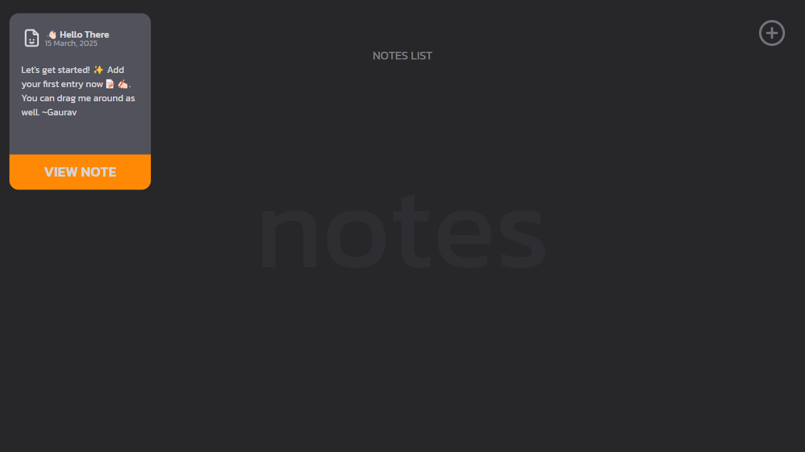
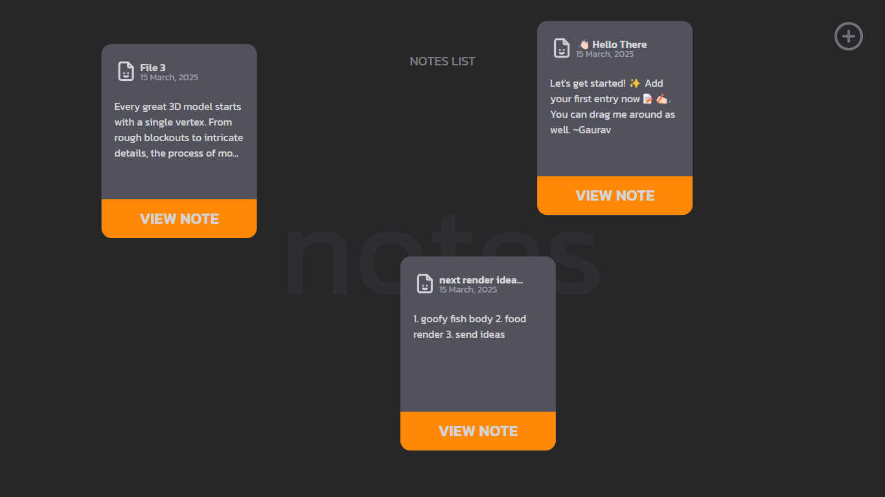

# React Notes Application

A simple draggable notes application built with React and Tailwind CSS.

## Features

- Add new notes with a title and description.
- Edit existing notes.
- Delete notes.
- Drag and move notes freely within the screen.
- Modern and Visually appealing UI.

## Tech Stack

- React
- Tailwind CSS
- React Icons
- react-tooltip
- motion/react (for draggable animations)

## Project Screenshots

## Contribution

Feel free to fork the repo and create pull requests with improvements.