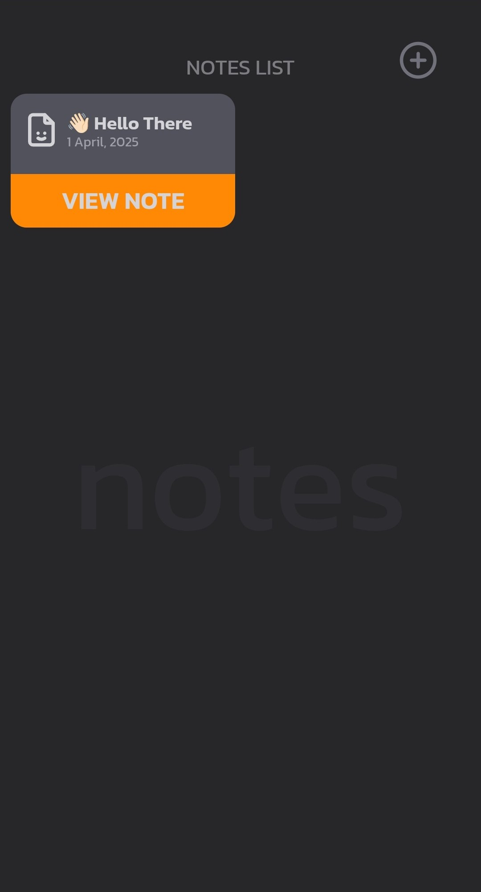
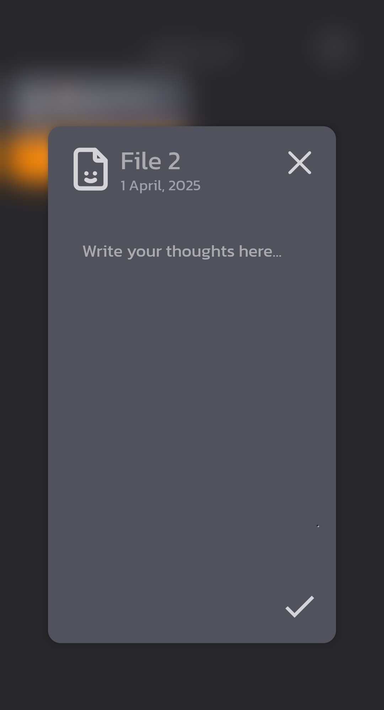
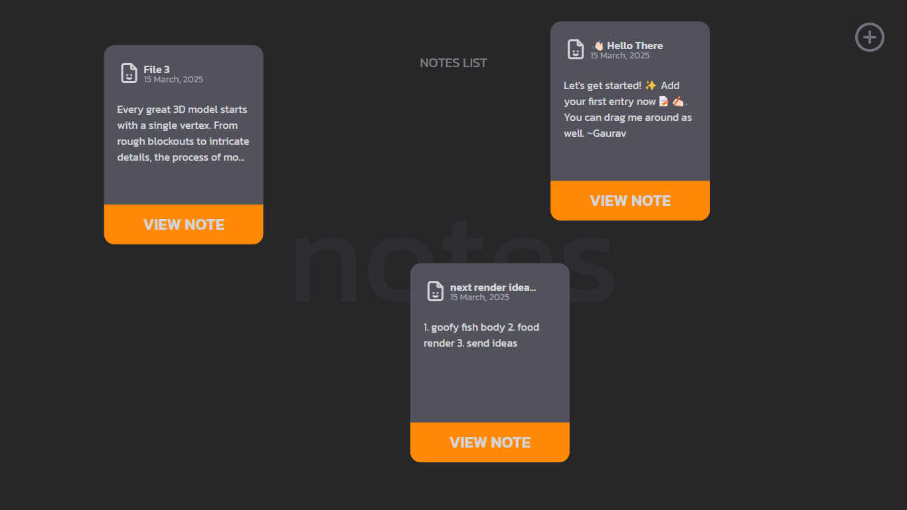
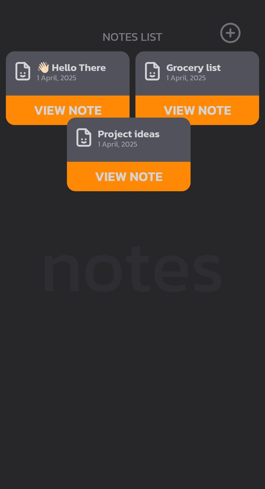

# React Notes Application

A simple and responsive draggable notes application built with React and Tailwind CSS.

## Features

- Add new notes with a title and description.
- Edit existing notes.
- Delete notes.
- Drag and move notes freely within the screen.
- Modern, visually appealing and responsive UI.

## Project Screenshots


<div align="center">
  
  
</div>

<div align="center">
  
  
</div>

<div align="center">
  
  
</div>

## Tech Stack

- React
- Tailwind CSS
- React Icons
- react-tooltip
- Framer Motion (for draggable animations)
- Node.js
- Express

## Dependencies
### Frontend
```bash
npm install react tailwindcss react-icons react-tooltip framer-motion
```

### Backend
```bash
npm install express joi
```

## Contribution

Feel free to fork the repo and create pull requests with improvements.
